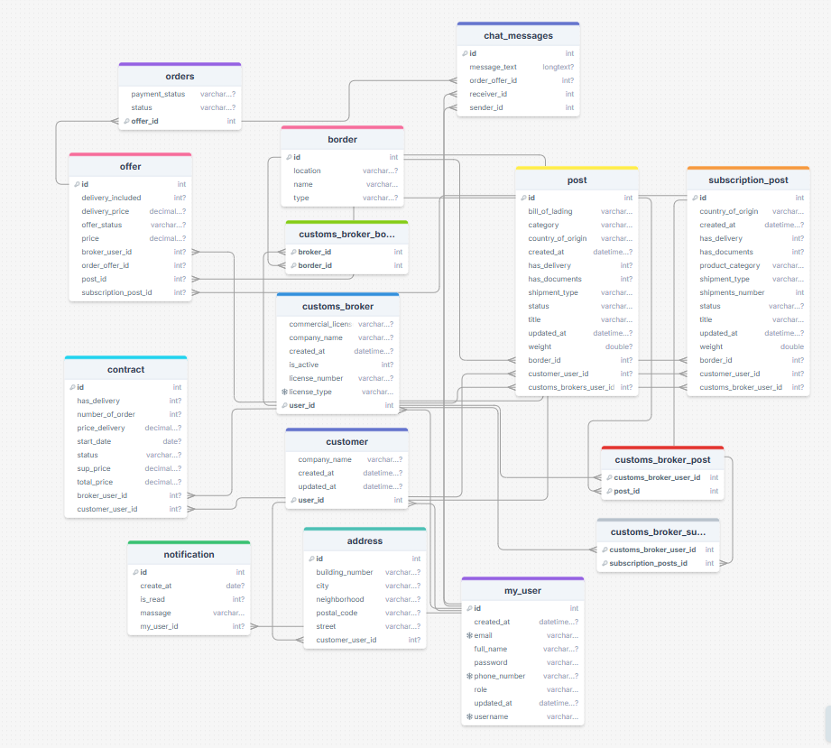

<!--
*** Thanks for checking out this README Template. If you have a suggestion that would
*** make this better, please fork the repo and create a pull request or simply open
*** an issue with the tag "enhancement".
*** Thanks again! Now go create something AMAZING! :D
-->

<!-- PROJECT SHIELDS -->
<!--
*** I'm using markdown "reference style" links for readability.
*** Reference links are enclosed in brackets [ ] instead of parentheses ( ).
*** See the bottom of this document for the declaration of the reference variables
*** for contributors-url, forks-url, etc. This is an optional, concise syntax you may use.
*** https://www.markdownguide.org/basic-syntax/#reference-style-links
-->
[![Contributors][contributors-shield]][contributors-url]
[![Forks][forks-shield]][forks-url]
[![Stargazers][stars-shield]][stars-url]
[![Issues][issues-shield]][issues-url]

<!-- PROJECT LOGO -->
 

  
 
<h3 align="center">Bayan</h3>

  

  This final project wraps up the Java Spring Boot Web Application Development bootcamp at Tuwaiq Academy.
  
    <a href="https://github.com/salemALmotiry/Bayan"><strong>Explore the docs »</strong></a>
     
     
    <a href="https://www.figma.com/design/zTIO7kQz6k6514lARuOtXo/Untitled1?node-id=0-1&p=f&t=1OL4NiM8cWGly5It-0">Figma</a>
    ·
    <a href="https://documenter.getpostman.com/view/40740226/2sAYJAcwpL">Postman API</a>
    ·
    <a href="https://github.com/salemALmotiry/Bayan/issues">Request Feature</a>
  

<!-- TABLE OF CONTENTS -->
## Table of Contents

* [About the Project](#about-the-project)
  * [Built With](#built-with)
  * [Live Version](#live-version)
  * [Usage](#usage)
* [Key Features](#key-features)
* [Diagram](#Diagram)
* [User Cases](#user-cases)
* * [Models](#models)
* [Extra Endpoints](#extra-endpoints)
  * [DTO Files](#dto-files)
* [License](#license)

<!-- ABOUT THE PROJECT -->
## About The Project
Bayan is a specialized platform designed to streamline customs clearance processes by connecting clients, 
whether individuals or companies, with certified customs brokers. 
Bayan offers an advanced shipment management system,
supported by innovative tools that help reduce time and effort while simplifying customs procedures.

بيان هي منصة متخصصة تهدف إلى تسهيل عمليات التخليص الجمركي من خلال ربط العملاء، سواء كانوا أفرادًا أو شركات، بمخلصين جمركيين معتمدين. تقدم بيان نظامًا متطورًا لإدارة الشحنات، مدعومًا بأدوات مبتكرة تُسهم في تقليل الوقت والجهد وتبسيط الإجراءات الجمركية.

<!-- ABOUT THE PROJECT -->
## 🛠 Key Features

### **Customer and Broker Reviews**
Facilitate mutual feedback with ratings and reviews to enhance collaboration.

---

### **Order Management**
Simplify order processing, track shipments, and manage delivery statuses effortlessly.

---

### **Shipment Tracking**
Track shipments with precision using various supported providers:

#### Small and Medium Shipments (Air and Land Logistics):
- **Aramex**
- **Naqel**
- **DHL**

#### Large Shipments (Air and Sea Logistics):
- **Saudi Cargo** (Air – specializes in large shipments)
- **MSC** (Sea – handles large cargo)

---

### **Offer and Request Handling**
Seamlessly create requests, receive offers, and manage collaboration with customs brokers.

---

### **File Management System**
Upload, organize, and download shipment-related documents with ease.

---

### **Notifications and Alerts**
Stay informed with instant updates through email and SMS notifications.

## Diagram

<!-- LIVE VERSION -->

## User cases

<!-- Contributing -->

## Models
| **Model Name**   |
|------------------|
| Notification     |
| Offer            |
| Order            |
| Post             |

## Extra endpoint

| **HTTP Method** | **Relative Path**                                    | **Service Method**                |
|-----------------|------------------------------------------------------|-----------------------------------|
| POST            | `/broker-rate-customer/{orderId}`                    | `brokerRateCustomer`              |
| POST            | `/customer-rate-broker/{orderId}`                    | `customerReviewBroker`            |
| PUT             | `/broker-update-review-customer/{reviewId}`          | `updateBrokerRating`              |
| PUT             | `/customer-update-review-broker/{reviewId}`          | `updateCustomerReview`            |
| GET             | `/broker-reviews/{brokerId}`                         | `allReviewsOnCustomBroker`        |
| GET             | `/customer/{customerId}/reviews`                     | `allReviewsOnCustomer`            |
| GET             | `/customer/{customerId}/average-rating`              | `allAverageOnCustomer`            |
| POST            | `/add-carrier/{orderId}`                             | `addCarrier`                      |
| PUT             | `/update-status/{deliveryId}`                        | `updateStatus`                    |
| POST            | `/track-air-shipment`                                | `trackAirShipment`                |
| POST            | `/track-sea-container`                               | `trackSeaContainer`               |
| POST            | `/track-by-carrier/{deliveryId}/{orderId}`           | `trackByCarrier`                  |
| PUT             | `/cancel-order/{orderId}`                            | `cancelOrder`                     |
| PUT             | `/cancel-order-broker/{orderId}`                     | `cancelOrderBroker`               |
| GET             | `/my-orders`                                         | `myOrders`                        |
| GET             | `/order-details/customer/{orderId}`                  | `orderDetailsForCustomer`         |
| GET             | `/order-details/broker/{orderId}`                    | `orderDetailsForBroker`           |
| GET             | `/my-orders-as-broker`                               | `myOrdersAsBroker`                |
| POST            | `/upload-multiple/{postId}`                          | `uploadMultipleFiles`             |
| GET             | `/get-files/{postId}`                                | `getFilesByPostAndUser`           |
| GET             | `/get-files-broker/{postId}/{customerId}`            | `getFilesByPostAndUserForBroker`  |
| GET             | `/download/{offerId}/{documentId}`                   | `downloadFile`                    |
| GET             | `/download-for-customer/{postId}/{documentId}`        | `downloadFileForCustomer`         |
| POST            | `/calculate-cbm`                                     | `calculateCbm`                    |

---

### DTO Files

| **Folder**   | **Type**   | **Name**               |
|--------------|------------|------------------------|
| IN           | Offer      | OfferDTO              |
| IN           | Offer      | OfferForManyOrder     |
| IN           | Offer      | OfferWithDeliveryDTO  |
| IN           | Post       | AddressDTO            |
| IN           | Post       | CbmDTO                |
| IN           | Post       | ChatMessagesDTO       |
| IN           | Post       | CustomerDTO           |
| OUT          | Post       | PostDTO               |
| OUT          | Post       | SubscriptionPostDTO   |
| OUT          | Post       | AddressDTO            |
| OUT          | Post       | BorderDTO             |
| OUT          | Post       | BrokerRentalsDTO      |

---

## Live version

You can see it working [here](https://replit.com/@salmotiry/Bayan)

Feel free to check the [issues page](https://github.com/salemALmotiry/Bayan/issues).

### Built With
This project was built using:

- **Java SE**
- **IntelliJ IDEA**
- **MySQL**
- **Spring Boot**
- **AWS**
- **Ultramsg**
- **Spring Boot Mail Integration**
- **Postman**
- **Git**
- **DataGrip**
- **Selenium**
- **ChromeDriver** – For running tests on Google Chrome.

<!-- MARKDOWN LINKS & IMAGES -->
<!-- https://www.markdownguide.org/basic-syntax/#reference-style-links -->
[contributors-shield]: https://img.shields.io/github/contributors/salemALmotiry/Bayan.svg?style=flat-square
[contributors-url]:https://github.com/salemALmotiry/Bayan/graphs/contributors
[forks-shield]: https://img.shields.io/github/forks/salemALmotiry/Bayan.svg?style=flat-square
[forks-url]: https://github.com/salemALmotiry/Bayan/network/members
[stars-shield]: https://img.shields.io/github/stars/salemALmotiry/Bayan.svg?style=flat-square
[stars-url]: https://github.com/salemALmotiry/Bayan/stargazers
[issues-shield]: https://img.shields.io/github/issues/salemALmotiry/Bayan.svg?style=flat-square
[issues-url]: https://github.com/salemALmotiry/Bayan/graphs/contributors
[product-screenshot]: images/tic-tac-toe.png

<!-- License -->

## 📝 License

This project is [MIT](https://opensource.org/licenses/MIT) licensed.
